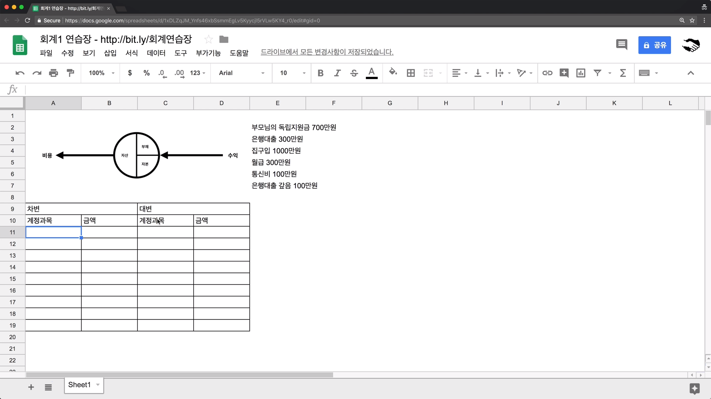
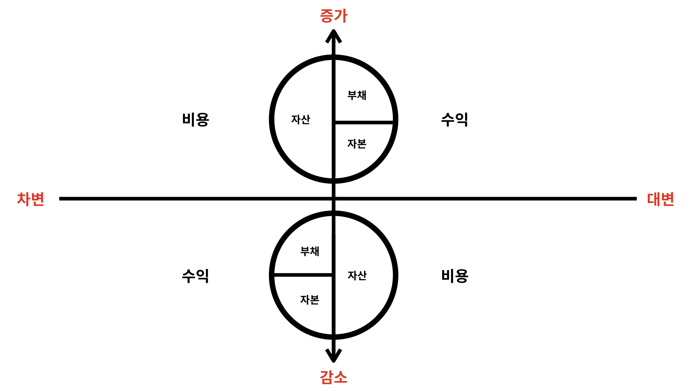
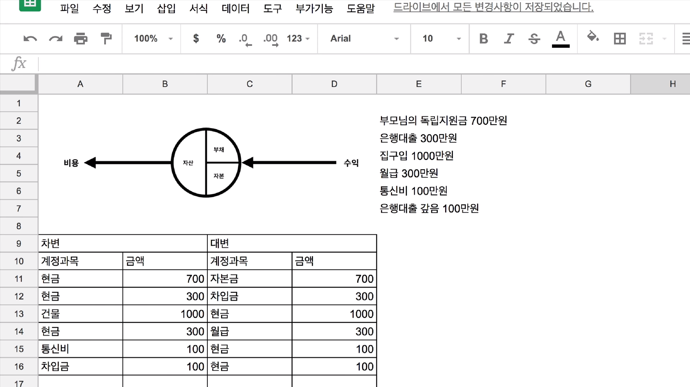

[← 목차로 돌아가기](./README.md)

## 2일차 - 거래의 이중성 ~ 복식부기 (2021-01-09)

### 거래의 이중성

저번 수업에서 남의 재무 상태를 봤다면,

이번 시간에는 **나의** 재무 상태를 볼 것임!!

그 전에, '거래란 무엇인가?'를 먼저 봅시다

> 회계를 만든 사람들은
>
> '모든 거래에는 이중성(두 얼굴)이 있다'
>
> 는 사실을 감지해요 (거래의 이중성)

이 거래의 이중성을 제대로 배우면, 인류 역사상 가장 중요한 발명 중 하나로 평가받는 **'복식부기'를 배울 토대**가 됨!

- Ex) 부모님께서 독립자금으로 **700만원**을 지원해주셨다

여기서, 이 돈은 '자산과 자본'이라는 이중성을 가지게 됨!

자본 => 갚을 필요가 없기에(=부채가 아니기에) 자본이 됨! (자본금 700만원이라 함)

자산 => 700만원을 현금으로 받았기에, 자산이 됨! (현금 700만원이라 함)

- Ex2) 1000만원의 집을 사고 싶으나, 독립자금으로 부족하여 은행에서 **300만원**을 빌림

여기서, 이 수익은 '부채와 자산'이라는 또다른 이중성을 가지게 됨!

부채 => 은행으로부터 300만원을 빚졌기 때문임! (차입금 300만원이라 함)

자산 => 300만원을 현금으로 받았음! (현금 300만원)

그리하여, 자본금 700만원(부채) + 차입금 300만원(자본) = 현금 1000만원(자산)이 됨!

- Ex3) 그래서 **1000만원**의 집을 샀음!

이 현금 1000만원을 가지고 집을 사면, **건물 1000만원이 자산이 되고**, 이 건물을 사기 위해 사용한 현금은 사라짐(정확히는 다른 사람에게 넘어감)

여기서도 '자산의 증가와 감소'라는 이중성이 생김!

- Ex4) 월급 **300만원**을 받았습니다

돈을 번 것이기 때문에 '수익'이 되고, 동시에 '자산'이라는 이중성이 생김!

(월급 300만원 수익 / 현금 300만원 자산)

- Ex5) 통신비 **100만원**(?!?!?!????)을 지출했습니다

쓰고 사라진 돈이기에 '비용'이 되고, 동시에 '자산의 감소'라는 이중성!

- Ex6) 은행빚 **100만원**을 갚았습니다

은행빚을 갚았기에 '부채의 감소'가 되고, '자산의 감소' 또한 작용함!

=> **모든 거래에는 이중성이 존재**하고, 이것이 '복식부기'로 이어짐!

### 복식부기

복식부기 = 거래의 이중성을 표로 나타낸 것! **(어려움)**

[회계연습장](https://bit.ly/회계연습장) ('파일' 탭 -> '사본 만들기')

도저히 못적겠어서 캡처로 대체 : 

계정(과목) = 거래의 분류

부채 / 자본의 증가, 수익의 **발생** => 대변

자산의 증가, 비용의 **발생** => 차변

감소의 경우, 서로 위치를 바꾸면 됨!

**(대변 / 차변 위치주의)**

- Ex1) 부모님께서 독립자금으로 **700만원**을 지원해주셨다

'자본의 증가'이기에, 대변이 됨!

동시에, '자산의 증가'이기 때문에, 차변이 됨!

(이해가 안되면 '거래의 8요소' 검색하는 것도 도움이 됨)

- Ex2) 1000만원의 집을 사고 싶으나, 독립자금으로 부족하여 은행에서 **300만원**을 빌림

'부채의 증가'이기에, 대변이 됨!

동시에, '자산의 증가'이기 때문에, 차변!

- Ex3) 그래서 **1000만원**의 집을 샀음!

'자산의 감소'이어서 대변!

'건물'이라는 자산의 증가여서 차변에 1000만원!

- Ex4) 월급 **300만원**을 받았습니다

'수익의 발생'이기에, 대변!

'자산의 증가'이기에, 차변!

- Ex5) 통신비 **100만원**을 지출했습니다

돈의 유출(비용의 발생)!

'비용의 발생' => 차변

'자산의 감소' => 대변!!!

- Ex6) 은행빚 **100만원**을 갚았습니다

'부채의 감소' => 차변

'자산의 감소' => 대변

결과적으로 이런 느낌 :

이렇게 거래를 '차변'과 '대변'으로 나누어 기록하는 것을 **'분개(分介)'**라고 함!

이렇게 나누어 기록한 것을 '분개장'이라고 함

(현실에서는 분개장에 '거래처', '일시' 등이 추가로 들어감)

> 컴퓨터를 만든 사람 중 한 명인 폰노이만은 당대에 유명한 수학 천재였습니다.
> 
> 누군가 그에게 수학을 어떻게 그렇게 잘하냐고 했더니 폰노이만은 이렇게 답했다고 합니다.
> 
> "수학은 이해하는 것이 아니라 익숙해지는 것입니다"
> 
> 우리의 목표는 회계를 이해하는 것이 아니라 익숙해지는 것이 아닐까요?
> 
> 이해나 암기는 익숙해지기 위한 수많은 방법 중 하나일 뿐입니다.
> 
> 회계에 대해서 자꾸 듣고, 이야기하고, 생각하다 보면 이해도 하기 전에 익숙해져 있을 것입니다.
> 
> 이해가 안 된다고 너무 초조해하지 마세요. 뇌에게 회계를 자꾸 경험시켜주세요.
