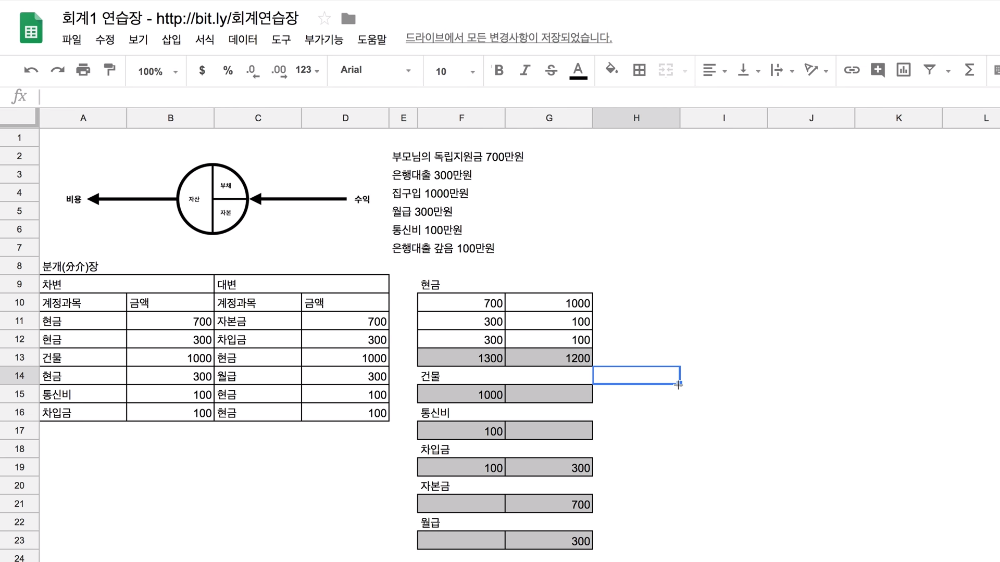
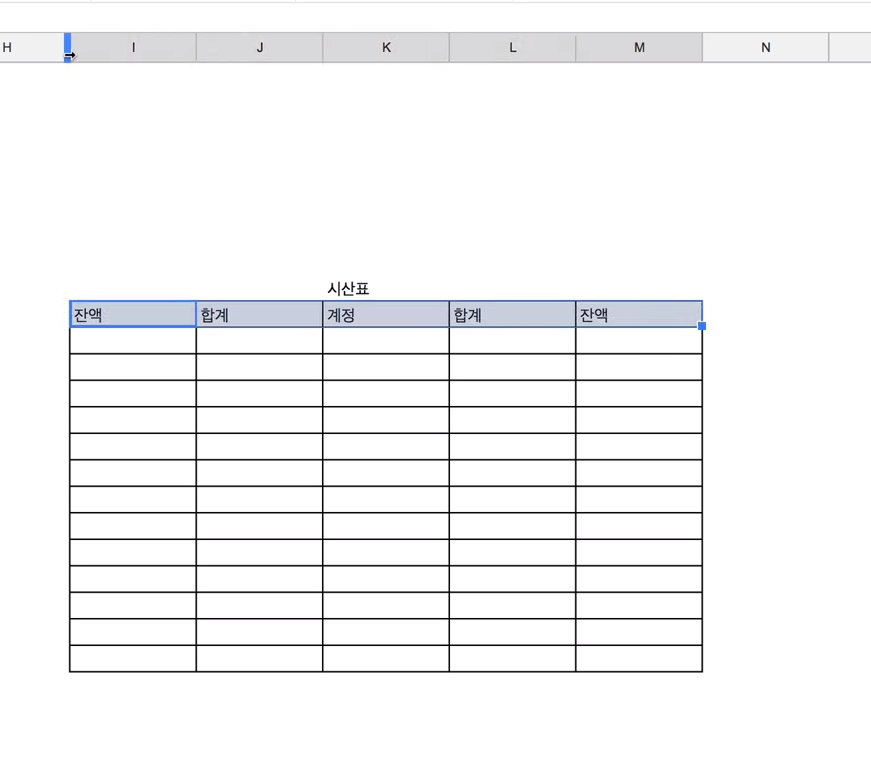
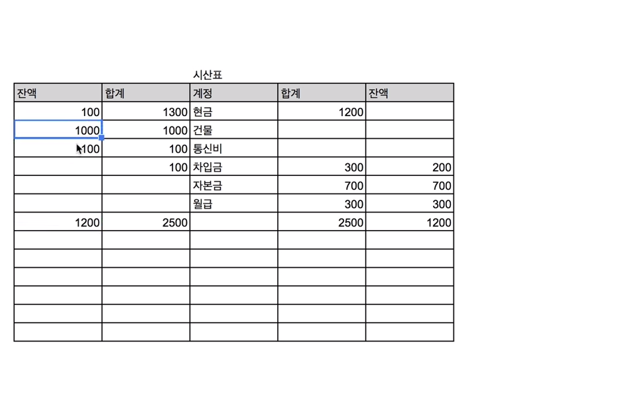
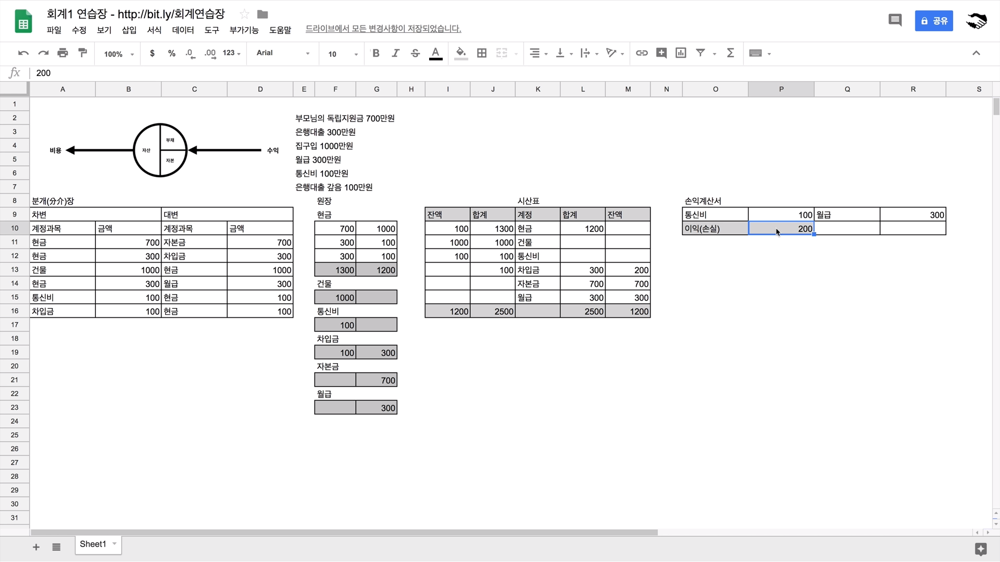
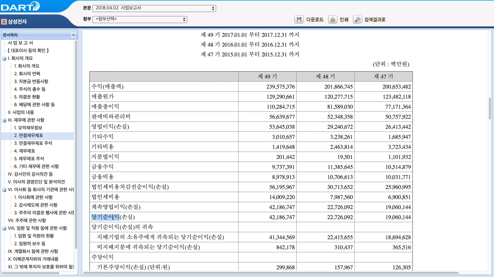
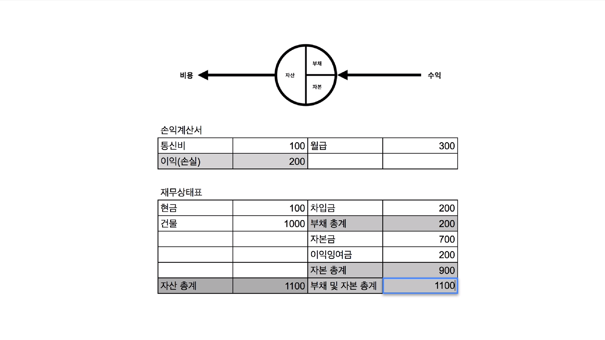

[← 목차로 돌아가기](./README.md)

## 3일차 - 전기 ~ 수업을 마치며 (2021-01-10)

### 전기

전기 = 계정과목별로 그룹핑 하는 것!

전기를 잘 정리정돈하면 그것이 손익계산서가 되고, 재무상태표가 됨!!

대충 이런느낌 :

(이걸 원장이라고 함, 회색은 총합계)

차변의 합과, 계정의 총합을 합치면 옳게 옮긴 것임!

사실, 원장은 분개장만 작성하면 만들어짐!

### 시산표

시산표 = 계정별로 **최종 합계**를 구하는 것!

대충 이렇게 만들면 틀은 잡은겁니다 :

계정 열에는 단어 그대로 계정을 넣으면 됨

합계 열에는 방향(좌/우) 맞춰서 합계를 넣으면 됨

좌측 합계 열과 우측 합계 열의 총합이 일치하면 잘 옮긴 것! (짜피 안맞으면 옮겨 주지도 않아서 크게 의미는 없,,)

잔액 열의 방향은 대변/차변하고 위치 동일하게 한다고 생각하면 됨!

(좌측 열일 경우 왼쪽에서 오른쪽을 빼고, 우측 열일 경우 오른쪽에서 왼쪽을 뺌)

### 손익 계산서

=> 어떠한 특정 기간에 얼마를 벌고, 사용해서 어느 정도가 남았는지 구하는 것!

손익 계산서에서 중요한 것은 수익과 비용!

현실에서 작성하는 손익 계산서는 여러 변수들 때문에 작성하기가 골아프지만, 일단 이론적으로는 쉬움! (= 일단 수업을 듣는 동안에는 골아프지는 않음)

- Ex) 수익이 150만원인데, 비용이 100만원이다

-> 150만원(수익) - 100만원(비용) = 50만원 (손익!, 양수면 이익 / 음수면 손실)

**★★★ 수익과 이익은 엄연히 다름!!!!!!!!!!!!!!! ★★★**

차변과 대변에 비용과 수익을 적어주고, 대변 - 차변 값의 합을 빼서 아래에 적음!

이 목록은 관심 사항에 따라 항목이 바뀔 수 있음!

대충 이런 식이긴 한데, 이 수업에선 못 본 척 하고 그냥 넘어감

**(교양 수업이지 전공 수업이 아님!!)**

### 재무상태표

이제 우리는 재무상태표를 작성할 모든 준비가 끝남!

재무상태표는 시산표를 가지고 만들면 됨

왼쪽에는 자산, 오른쪽에는 부채와 자본에 해당되는 잔액을 적으면 됨 **(비용 빼라!!!)**

### 수업을 마치며

> 공부를 하면 눈과 귀가 밝아집니다.
> 
> 하지만 주의깊게 관찰하지 않으면 그 사실을 무심코 지나칠 수 있습니다.
> 
> 억울한 일입니다. 조용히 주위를 둘러보세요.
> 
> 시야가 놀랍게 확장된 것을 느낄 수 있을 것입니다.
> 
> 이런 느낌을 뇌에게 자주 경험시켜줘야 합니다.
> 
> 그럼 뇌는 조건반사적으로 공부를 반기게 될 것입니다. 
> 
> 저는 여기 남아서 후속 수업을 준비해야겠습니다.
> 
> 후속 수업이 궁금하신 분은 회계야학에 입학하세요.
> 
> 동문이 되시면 다양한 소식을 전해드립니다.
> 
> [acc.yah.ac](https://acc.yah.ac)
> 
> 회계인이 된 것
> 
> 진심으로
> 
> 축하합니다

