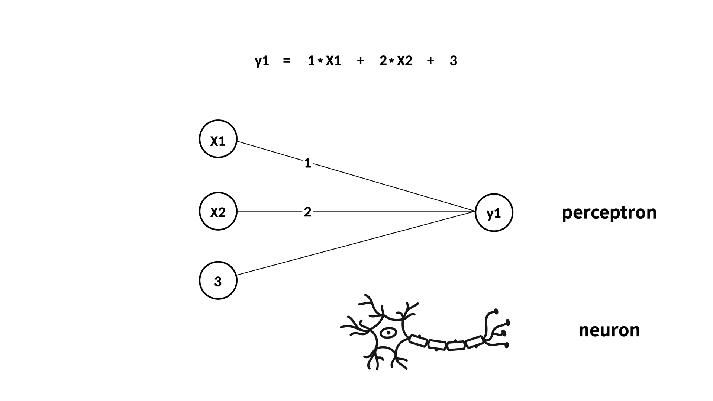
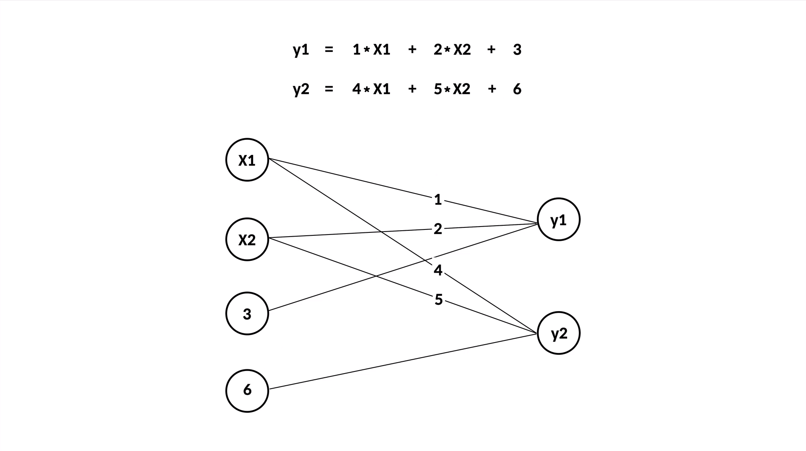
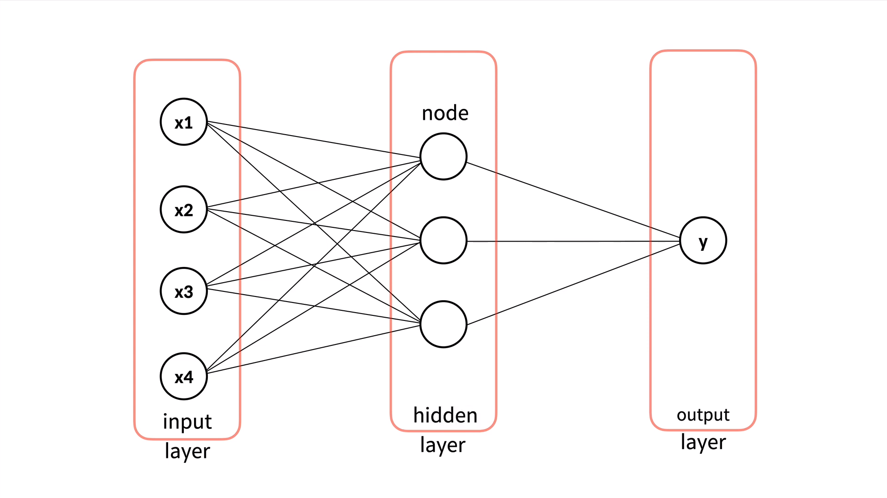

[← 목차로 돌아가기](./README.md)

## 10일차 - Tensorflow(JS) : tensorflowjs-vis ~ 수업을 마치며 (2021-01-16)

### tensorflowjs-vis

애가 얼마나 학습 되었는지 구체적인 지표를 보고, 그것을 토대로 의사결정을 내려봅시다

[TensorFlowJS Github](https://github.com/tensorflow/tfjs)

README에서 `TensorFlow.js Vis`를 찾아 눌러줍니다

-> 학습정도를 육안으로 보여주는 여러 도구임!

`10.3.html`을 복사해서, README에 있는 코드를 넣읍시다

이 도구의 사용방법은 [공식 문서](https://js.tensorflow.org/api_vis/1.4.3)를 보면 됨

1. 11.html

```html
<!DOCTYPE html>
<html>
 
<head>
    <title>TensorFlow.js Tutorial - boston housing </title>
 
    <!-- Import TensorFlow.js -->
    <script src="https://cdn.jsdelivr.net/npm/@tensorflow/tfjs@1.0.0/dist/tf.min.js"></script>
    <script src="https://cdn.jsdelivr.net/npm/@tensorflow/tfjs-vis"></script>
    <script src="10.3.js"></script>
</head>
 
<body>
    <script>
        /*
        var 보스톤_원인 = [
            [0.00632,18,2.31,0,0.538,6.575,65.2,4.09,1,296,15.3,396.9,4.98],
            [0.02731,0,7.07,0,0.469,6.421,78.9,4.9671,2,242,17.8,396.9,9.14]
        ];
        var 보스톤_결과 = [
            [24], 
            [21.6]
        ];
        */
     
        // 1. 과거의 데이터를 준비합니다. 
        var 원인 = tf.tensor(보스톤_원인);
        var 결과 = tf.tensor(보스톤_결과);
 
        // 2. 모델의 모양을 만듭니다. 
        var X = tf.input({ shape: [13] });
        var Y = tf.layers.dense({ units: 1 }).apply(X);
        var model = tf.model({ inputs: X, outputs: Y });
        var compileParam = { optimizer: tf.train.adam(), loss: tf.losses.meanSquaredError }
        model.compile(compileParam);
        tfvis.show.modelSummary({name:'요약', tab:'모델'}, model);
 
        // 3. 데이터로 모델을 학습시킵니다. 
//         var fitParam = {epochs: 100}
        var _history = [];
        var fitParam = { 
          epochs: 100, 
          callbacks:{
            onEpochEnd:
              function(epoch, logs){
                console.log('epoch', epoch, logs, 'RMSE=>', Math.sqrt(logs.loss));
                _history.push(logs);
                tfvis.show.history({name:'loss', tab:'역사'}, _history, ['loss']);
              }
          }
        } // loss 추가 예제
        model.fit(원인, 결과, fitParam).then(function (result) {
             
            // 4. 모델을 이용합니다. 
            // 4.1 기존의 데이터를 이용
            var 예측한결과 = model.predict(원인);
            예측한결과.print();
 
        });  
 
        // 4.2 새로운 데이터를 이용
        // var 다음주온도 = [15,16,17,18,19]
        // var 다음주원인 = tf.tensor(다음주온도);
        // var 다음주결과 = model.predict(다음주원인);
        // 다음주결과.print();
    </script>
</body>
 
</html>
```

### 딥러닝 - 강의 1

인간의 신경세포(뉴런, neuron)를 모방한 것이 perceptron! (일종의 공식인데, 자세한건 아래 이미지)





이제, 뉴런으로 이루어진 거대한 네트워크인 인공신경망(ANN, Artificial Neural Network)으로 딥러닝을 만들어 봅시다.



이제, 히든 레이어를 코드로 추가 해 봅시다.

### 딥러닝 - 강의 2


1. 12.2.html

```html
<!DOCTYPE html>
<html>
 
<head>
    <title>TensorFlow.js Tutorial - boston housing </title>
 
    <!-- Import TensorFlow.js -->
    <script src="https://cdn.jsdelivr.net/npm/@tensorflow/tfjs@1.0.0/dist/tf.min.js"></script>
    <script src="https://cdn.jsdelivr.net/npm/@tensorflow/tfjs-vis"></script>
    <script src="10.3.js"></script>
</head>
 
<body>
    <script>
        /*
        var 보스톤_원인 = [
            [0.00632,18,2.31,0,0.538,6.575,65.2,4.09,1,296,15.3,396.9,4.98],
            [0.02731,0,7.07,0,0.469,6.421,78.9,4.9671,2,242,17.8,396.9,9.14]
        ];
        var 보스톤_결과 = [
            [24], 
            [21.6]
        ];
        */
     
        // 1. 과거의 데이터를 준비합니다. 
        var 원인 = tf.tensor(보스톤_원인);
        var 결과 = tf.tensor(보스톤_결과);
 
        // 2. 모델의 모양을 만듭니다. 
        var X = tf.input({ shape: [13] });

        /* Hidden Layers S */
        // activation은 그냥 '딥러닝에 사용된다'고만 알고 넘어갑시다
        var H1 = tf.layers.dense({ units: 13, activation:'relu' }).apply(X);
        var H2 = tf.layers.dense({ units: 13, activation:'relu' }).apply(H1);
        /* Hidden Layers E */

        var Y = tf.layers.dense({ units: 1 }).apply(H2);
        var model = tf.model({ inputs: X, outputs: Y });
        var compileParam = { optimizer: tf.train.adam(), loss: tf.losses.meanSquaredError }
        model.compile(compileParam);
        tfvis.show.modelSummary({name:'요약', tab:'모델'}, model);
 
        // 3. 데이터로 모델을 학습시킵니다. 
//         var fitParam = {epochs: 100}
        var _history = [];
        var fitParam = { 
          epochs: 100, 
          callbacks:{
            onEpochEnd:
              function(epoch, logs){
                console.log('epoch', epoch, logs, 'RMSE=>', Math.sqrt(logs.loss));
                _history.push(logs);
                tfvis.show.history({name:'loss', tab:'역사'}, _history, ['loss']);
              }
          }
        } // loss 추가 예제
        model.fit(원인, 결과, fitParam).then(function (result) {
             
            // 4. 모델을 이용합니다. 
            // 4.1 기존의 데이터를 이용
            var 예측한결과 = model.predict(원인);
            예측한결과.print();
 
        });  
 
        // 4.2 새로운 데이터를 이용
        // var 다음주온도 = [15,16,17,18,19]
        // var 다음주원인 = tf.tensor(다음주온도);
        // var 다음주결과 = model.predict(다음주원인);
        // 다음주결과.print();
    </script>
</body>
 
</html>
```

### 수업을 마치며

이 수업은 TensorFlowJS를 하는 법을 배웠지만, **잘 하는 법은 아님!** (직접 경험하고, 해결하는 과정에서 배워야함!)

어떠한 잘 하는 법들이 필요할 지 봅시다

-----

이 수업에서는 '지도학습의 회귀'를 배웠습니다..만 종속변수가 범주형이라면?

-> '지도학습 분류'가 필요함!

-----

종속변수가 멀티미디어라면 어떻게 이용할까?

-> 이미지를 숫자로 변환!

-> 모든 데이터는 숫자로 변환이 가능하고, 숫자로 변환만 성공하면 많은 일을 할 수 있음!

-----

우리는 지금까지 학습에 사용한 데이터로 평가를 했음!

-> 하지만, 제대로 된 평가를 하려면 '평가용 데이터'가 따로 있어야함!

-----

무엇보다도 중요한 것은 '충분한 양의 데이터'!

빅데이터를 다루는 방법에 관해서도 관심을 가져봅시다.

(머신러닝이 주목을 받게 된 계기가 빅데이터라고 해도 과언이 아님)

-----

코드를 짜는 것이 너무 어렵다면, Orange3 등과 같이 코드를 짤 필요가 없는 기술들도 찾아봅시다..

그 외에도 공부 할 것이 많지만, 지금은 **배운 것을 가지고 이용하는 것이 더 중요함!**
