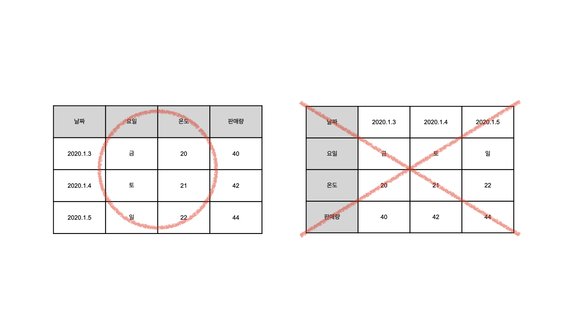

[← 목차로 돌아가기](./README.md)

## 3일차 - 머신러닝1 : 직업의 시작 ~ 심리전 (2021-01-06)

### 직업의 시작

일반적으로 현실은 데이터로 표현이 불가능!

But, 현실을 데이터로 표현하고 처리할 수 있게 하는 것 중 하나가 머신러닝

우리가 데이터로 만들 수 있는 현실의 것들은 많음!

==> 그러한 데이터를 어떻게 뽑아내고, 어떻게 가공할 지가 중요!

이러한 현실을 변화시키는 일을 하는 것 : 데이터 산업!

```
데이터 산업 = 데이터 과학 + 데이터 공학
```

과학은 데이터를 만들고, 만들어진 데이터를 이용하는 일

공학은 데이터를 다루는 도구를 만들고, 도구를 관리하는 일

> 지금 우리는 데이터 과학자, 데이터 공학자가 되기 위한 출발점에 서 있습니다.
> 
> 기대되시죠?
> 
> 출발합시다.

### 표

데이터가 아무리 복잡해도 표에만 넣으면 정리가 가능함!

그리고 이렇게 데이터를 정리해서 다른 도구에 옮겨 담으면, 컴퓨터의 자원을 이용해서 강력한 로봇을 만들 수 있음!

여기에 머신러닝을 넣으면 인간만이 지닐 수 있다고 여겨졌던 통찰력을 기계도 발휘할 수 있게 됨!

**표에서 가로는 '행', 세로는 '열'**



사실 어느 쪽으로 쓰든 상관은 없는데, 데이터 산업에서는 왼쪽으로 씀!

표(데이터 셋) === 데이터들의 모임!

데이터 산업에서는 행과 열 대신 조금 더 어려운 표현을 사용!

:행(row)

- 개체(instance)
- 관측치(observed value)
- 기록(record)
- 사례(example)
- 경우(case)

:열(column)

- 특성(feature)
- 속성(attribute)
- 변수(variable)

> 이제 여러분은 안들리던 것이 들리고,
> 
> 안 보이던 것이 보이기 시작할 것입니다.
> 
> 귀가 깨끗해지고, 눈이 밝아진 것을 축하합니다.
> 
> 중요한 출발점에 서신 것입니다.

### 독립변수와 종속변수

데이터를 표에 가두기만 하는 것이 아니라, 필요한(의미있는) 데이터를 뽑아낼 수 있어야 함!

```
독립변수 : 원인이 되는 열 (원인은 독립적!)
종속변수 : 결과가 되는 열 (결과는 원인에 종속되어 있음!)
```

```
상관관계 : 서로 상관이 있는 관계
인과관계 : 각 열이 원인과 결과의 관계

(상관관계 > 인과관계!)
```

[기획서 구경하기](https://docs.google.com/spreadsheets/d/1mdCb-xRYBAsAOeiC7miyQgcMqVzCpg_67OmfdGRvVAY/edit#gid=1783703437)

> 여러분은 익숙했던 표를 낯설게 바라보게 되었습니다.
> 
> 특성, 개체, 독립변수, 종속변수와 같이 어려운 표현들도 이해할 수 있는 귀와 눈을 가지게 되었습니다.
> 
> 앞으로 배우게 될 어떤 개념도
> 
> 여러분의 눈썰미를 이렇게 극적으로
> 
> 바꿔놓지는 못할 것입니다.
> 
> 오늘 하루 잘 보내셨네요.
> 
> 축하합니다.

### 심리전

**적을 내용 없음**