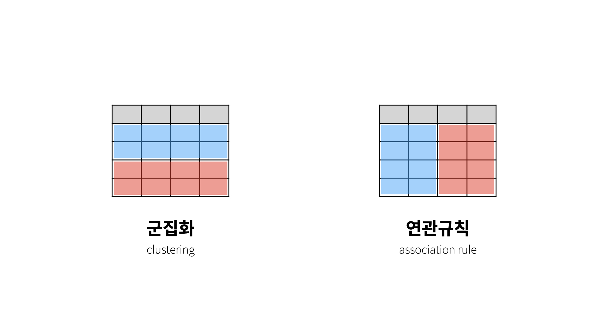
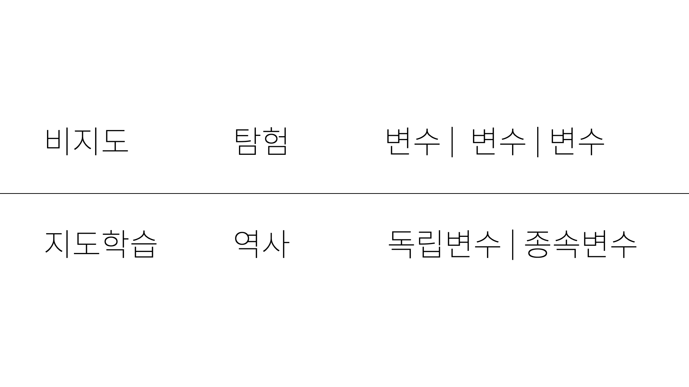
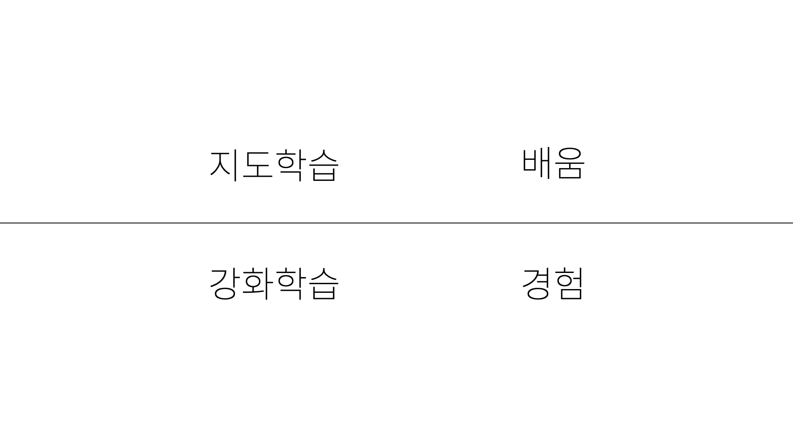
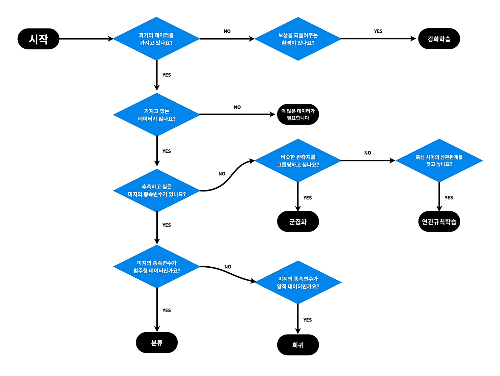

[← 목차로 돌아가기](./README.md)

## 5일차 - 머신러닝1 : 비지도 학습 ~ 수업을 마치며 (2021-01-09)

### 비지도 학습

- 군집화 : 비슷한 것(행)들을 찾아서 그룹을 만드는 것! (행 그룹핑)

(분류는 군집화 된 그룹을 가지고 물건을 위치시키는거고!!!)

- 연관규칙학습(장바구니 분석) : 서로 연관된 특징을 찾아내는 것! (열 그룹핑)

그러면 비지도 학습은 대체 무엇인가?

지도학습은 역사적(원인과 결과를 바탕으로 처음보는 원인에 대한 결과를 도출하는 것)이어서 독립 / 종속변수가 필요함!

(비지도학습은 한마디로 정의하기 어려움)

> 변환은 무엇일까요?
>
> 다 알아버리면 아쉽잖아요.
>
> 탐욕스러운 수업이 되지 않기 위해서 여러분을 위한 까치밥으로 남겨두겠습니다.

### 강화학습

강화학습의 핵심 : **일단 해보는 것!**

사람이 무언가를 배우는 과정인 '실패와 성공'을 기계에게 대입해서, **'더 많은 보상(성공)을 받을 수 있는 정책'**을 만드는 것이 강화학습에서 중요함!

알파고와 자율주행 기술도 이러한 강화학습을 사용함

[강화학습의 사례](https://bit.ly/ml1-reinforcement-list)

### 나에게 필요한 머신러닝을 찾아내는 방법

지금까지 많은 것들을 배워 왔지만, 막상 실전에서 사용하기가 어려울 수도 있음

=> 너무 많은 것을 배워서 머릿속이 복잡한 것!

그래서 수업에서 제시하는 판단의 지도 : 

물론 이것이 정답은 아님!

현실에서 사용되는 머신러닝은 더 복잡하기에, 그것을 감안하여 줄인 지도임

> ... 더 정확한 의미와 표현들은
> 여러분 각자의 몫으로 남겨두겠습니다.
> 
> 한편, 우리에게는 소위 '직관'이라는 능력이 있습니다.
> 
> 직관은 의식적으로 판단하지 않아도, 순식간에 필요한 것을 알아내는 능력입니다.
> 
> 그런데 이런 능력도 실제로는 훈련을 통해서 만들어지는 것 같습니다.
> 
> 어떤 사안에 대해서 의식적인 판단을 자주하다 보면, 무의식에는 어떤 지도가 그려집니다.
> 
> 그 지도가 완성되면, 의식적으로 생각하지 않아도 무의식의 영역에서
> 
> 엄청난 속도로 연산이 일어나는 것이 아닐까요?
> 
> 이런 연산이 빠르고 정확한 사람이 그 분야의 중급자이겠죠.
> 
> 이 지도는 중급자가 되는 여정에 좋은 길잡이가 되어줄 것입니다.
> 
> 머신러닝 동네의 지도까지 손에 넣으셨네요.
> 
> 정말 축하합니다.
> 
> 여기까지 온 자기 자신에게 선물합시다.
> 
> 기특하다고 칭찬해 주세요.

### 수업을 마치며

> 여기까지입니다.
> 
> 벌써 머신러닝 엔지니어가 된 것 같나요?
> 
> 된 것 같은 것이 아니라 된 것입니다.
> 
> 어떤 분야에 어떤 부품이 있고, 그 부품이 언제 필요한지 안다면
> 
> 그 사람은 그 분야의 생산자입니다.
> 
> 집이란 이런 것들을 조립해서 만든 완제품입니다.
> 
> 이 완제품을 만든 것은 누구일까요?
> 
> 건축가도 아니고, TV 제조사도 아니고
> 
> 바로 집의 주인인 자기 자신입니다.
> 
> 가구를 직접 만들지 않았지만 우리는 가구라는 부품을 소비해서
> 
> 나의 집을 더욱 정돈된 공간으로 생산한 것입니다.
> 
> 그런 점에서 나의 집에 대한 최종 생산자는 나 자신입니다.
> 
> 이 수업의 목적은 소비자로만 살아왔던 분들이
> 
> 생산자가 될 수 있도록 유도하는 것입니다.
> 
> 생산자가 되기 위해서 제일 먼저 필요한 것은,
> 
> 지금까지 소비라고 생각해 왔던 행동들이 사실은 생산활동이었다는 것을 자각하는 것입니다.
> 
> 생산과 소비는 편의상 구분해 놓은 개념의 신기루일 뿐 사실은 하나라는 것을 인식해주세요.
> 
> 우리가 그렇게 좋아하는 소비처럼 생산도 설레는 것이라는 점을 곧 알게 될 것입니다.
> 
> 이제 여러분은 머신러닝이라는 부품을 결합해서
> 
> 더욱 쓸모있는 완제품을 만들 수 있는 생산자가 될 만반의 준비가 끝났습니다.
> 
> 다시 말해서, 머신러닝 엔지니어가 된 것입니다.
> 
> 숙련된 머신러닝 엔지니어와 여러분은 현실적으로는 아직 큰 차이가 있지만,
> 
> 철학적으로는 아무런 차이가 없다고 감히 말씀드립니다.
> 
> 철학적인 의미로서 머신러닝 엔지니어가 되신 것을 축하드립니다.
> 
> 현실적인 의미로서 머신러닝 엔지니어가 언젠가 되시길 응원합니다.
> 
> 다시 한번 축하합니다.
> 
> 축하합니다.

### 기여자

[링크](https://opentutorials.org/course/4548/28953)