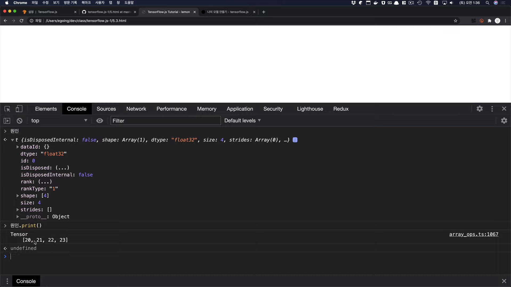

[← 목차로 돌아가기](./README.md)

## 7일차 - Tensorflow(JS) : 나의 모델 만들기 (2021-01-12)

### 나의 모델 만들기 - 강의 1

과거에는 어떠한 공식을 만든다는 것이 쉽지 않았음 -> 어떠한 현상을 관찰하고, 그것을 수학적으로 도출해낸다는(공식으로 만들어낸다는) 것이 결코 쉬운 일은 아님!

그렇기에, 이런 것들은 엘리트들과 권력자들의 전유물이었음

하지만, 머신러닝이 대중화 되고 있기에 누구나 쉽게 본인에게 필요한 공식을 만들 수 있음!!

그러기 위해 우리가 해야할 것 -> 기계에게 정확하고 많은 데이터 주기

우리는 이전에 예시로 들었던 '레모네이드 장사'에 대한 모델을 직접 만들 거임!

1. 과거의 데이터를 코드로 만들기

```javascript
var 온도 = [20, 21, 22, 23];
var 판매량 = [40, 42, 44, 46];
```

But, TensorFlow에서는 이 배열을 그대로 넣을 수 없음! -> Tensor로 변환해야함!

```javascript
var 원인 = tf.tensor(온도);
var 결과 = tf.tensor(판매량);
```

2. 모델의 모양 만들기

```javascript
var X = tf.input({shape: [1] /* 열의 갯수 */});
var Y = tf.layers.dense({units: 1 /* 결과 열의 갯수 */}).apply(X);
var model = tf.model({inputs: X, outputs: Y});
```

3. 모델 컴파일하기

지금은 몰라도 된대여

```javascript
var compileParam = {optimizer: tf.train.adam(), loss: tf.losses.meanSquaredError};
model.compile(compileParam);
```

4. 데이터로 모델 학습(FIT)하고, 이용하기

```javascript
var fitParam = {epochs: 100}; // 학습 횟수
model.fit(원인, 결과, fitParam).then(function (result) {
    var 다음주온도 = [15, 46, 17, 18, 19];
    var 다음주원인 = tf.tensor(다음주온도, [다음주온도.length, 1]);
    var 다음주결과 = model.predict(다음주원인); // 예측
    다음주결과.print();
});
```

5. 결과

```javascript
Tensor[
    [29.990654],
    [31.9873714],
    [33.9840889],
    [35.9808044],
    [37.9775238]
]
```

모델에서 도출한 공식 : `1.99 * 온도 + 0.03`

### 나의 모델 만들기 - 강의 2

1. TensorFlow.js 라이브러리 불러오기

검색 : `tensorflow` -> 텐서플로우 홈페이지 -> `자바스크립트용` 클릭 -> `TensorFlow.js 시작하기` ->

상단 `튜토리얼` 탭 -> `설정` -> HTML 스크립트 복붙 OR npm 라이브러리 설치

### 나의 모델 만들기 - 강의 3

[샘플코드](https://github.com/egoing/tensorflow.js-1)

1. 5.html

```html
<!DOCTYPE html>
<html>
    <head>
        <title>TensorFlow.js Tutorial - lemon</title>

        <!-- Import TensorFlow.js -->
        <!-- <script src="https://cdn.jsdelivr.net/npm/@tensorflow/tfjs@1.0.0/dist/tf.min.js"></script> -->
    </head>
    
    <body>
        <script>
            // 1. 과거의 데이터를 준비합니다. 
            // var 온도 = [20,21,22,23];
            // var 판매량 = [40,42,44,46];
            // var 원인 = tf.tensor(온도);
            // var 결과 = tf.tensor(판매량);
    
            // 2. 모델의 모양을 만듭니다. 
            // var X = tf.input({ shape: [1] });
            // var Y = tf.layers.dense({ units: 1 }).apply(X);
            // var model = tf.model({ inputs: X, outputs: Y });
            // var compileParam = { optimizer: tf.train.adam(), loss: tf.losses.meanSquaredError }
            // model.compile(compileParam);
    
            // 3. 데이터로 모델을 학습시킵니다. 
            // var fitParam = { epochs: 100} 
            // var fitParam = { epochs: 100, callbacks:{onEpochEnd:function(epoch, logs){console.log('epoch', epoch, logs);}}} // loss 추가 예제
            // model.fit(원인, 결과, fitParam).then(function (result) {
                // 4. 모델을 이용합니다. 
                // 4.1 기존의 데이터를 이용
                // var 예측한결과 = model.predict(원인);
                // 예측한결과.print();
            // });  
    
            // 4.2 새로운 데이터를 이용
            // var 다음주온도 = [15,16,17, 18, 19]
            // var 다음주원인 = tf.tensor(다음주온도);
            // var 다음주결과 = model.predict(다음주원인);
            // 다음주결과.print();
        </script>
    </body>
 
</html>
```

2. 모델에 들어갈 데이터 입력하고 출력값 확인하기



### 나의 모델 만들기 - 강의 4

1. 모델의 모양 만들기

코드 상에서 X는 입력, Y는 출력!

`tf.model()`을 통해 입/출력 정의하고 모델 구조 만듦!

컴파일을 위해 입력값을 만듦 (optimizer는 학습 방법, loss는 모델의 완성도를 측정하기 위한 방법)

구조와 입력값을 가지고 컴파일까지

### 나의 모델 만들기 - 강의 5~6

1. 모델을 학습(FIT, Training, Run)시키기

학습 파라미터에서 epochs는 학습 반복 횟수

2. 학습된 모델을 확인하기

`model.fit().then()` 에서 확인하기

`model.predict(원인)` 을 통해 한번 테스트를 해봅시다

안맞으면 학습 횟수를 늘리던가 (작업속도 느려짐), `model.fit()`을 여러번 굴리면 됨 (`model.fit()`은 기존 모델에 결과값 추가하는 방식임!)

3. 실제에서는 어떻게 테스트?

일부 데이터만 학습시키고, **학습되지 않은 데이터를 확인하는 방식**을 채택!

4. 이제 그냥 쓰면 됩니다

새로운 입력값을 만들고, Tensor로 변환해서 `model.predict()` 사용하면 나옴!

