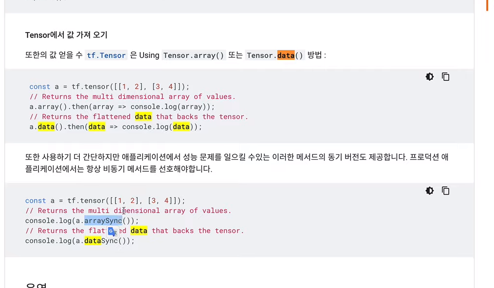

[← 목차로 돌아가기](./README.md)

## 8일차 - Tensorflow(JS) : 정확도 측정 ~ 졸업식과 입학설명회 (2021-01-14)

### 정확도 측정

입력값을 건드려 봅시다

```javascript
var fitParam = {
    epochs: 100,
    callbacks: {
        onEpochEnd: function(epoch, logs) {
            console.log('epoch', epoch, logs)
        }
    }
}
```

`onEpochEnd`는 한번 학습이 될 때마다 호출됨!

(epoch는 학습 횟수, logs는 학습 정도(7일차 코드 기준: 평균 제곱 오차값, MSE)를 나타냄)

### 모델의 정체

모델의 기본 구조 : `y=a*x+b` (입력 x, 출력 y)

a를 가중치(weight), b를 편향(bias)라고 함!

`model.getWeights()` 로 가중치와 편향을 Tensor 형태로 가져올 수 있음!




### 모델의 저장과 불러오기

지금까지 우리는 웹페이지 안에서 모델을 만들고, 사용하는 것을 만들었음!

But, 필요할때마다 모델을 학습시키는 것은 낭비!

[TensorFlowJS 문서 - 모델 저장 및 리로드](https://tensorflow.org/js/guide/save_load)

### 졸업식과 입학설명회

> 미래로 공부를 유보하고 당당하게 완주를 선언할 수 있는 지점까지 오셨습니다.
> 
> 축하합니다.
> 
> 동시에 조금 더 공부하기도 좋은 지점입니다.
> 
> 앞으로 어떤 내용을 배울 것인지를 살펴보겠습니다.

- 학습 열을 수십개로 놓고 작업
- 딥러닝
