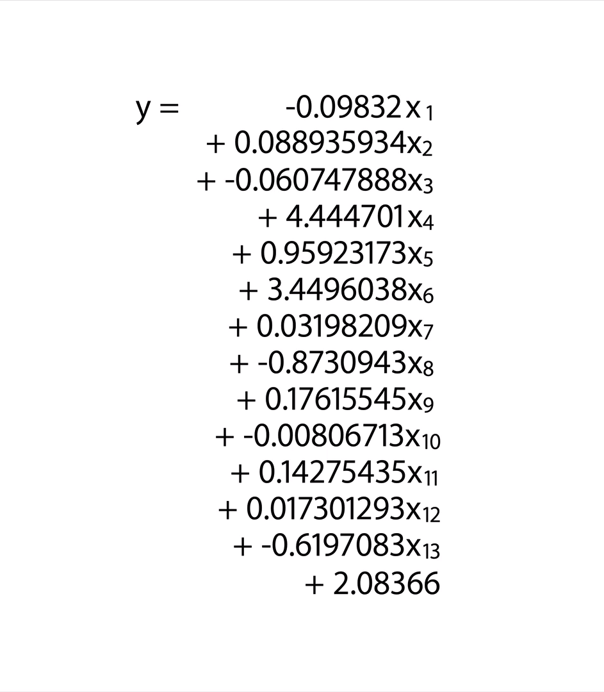
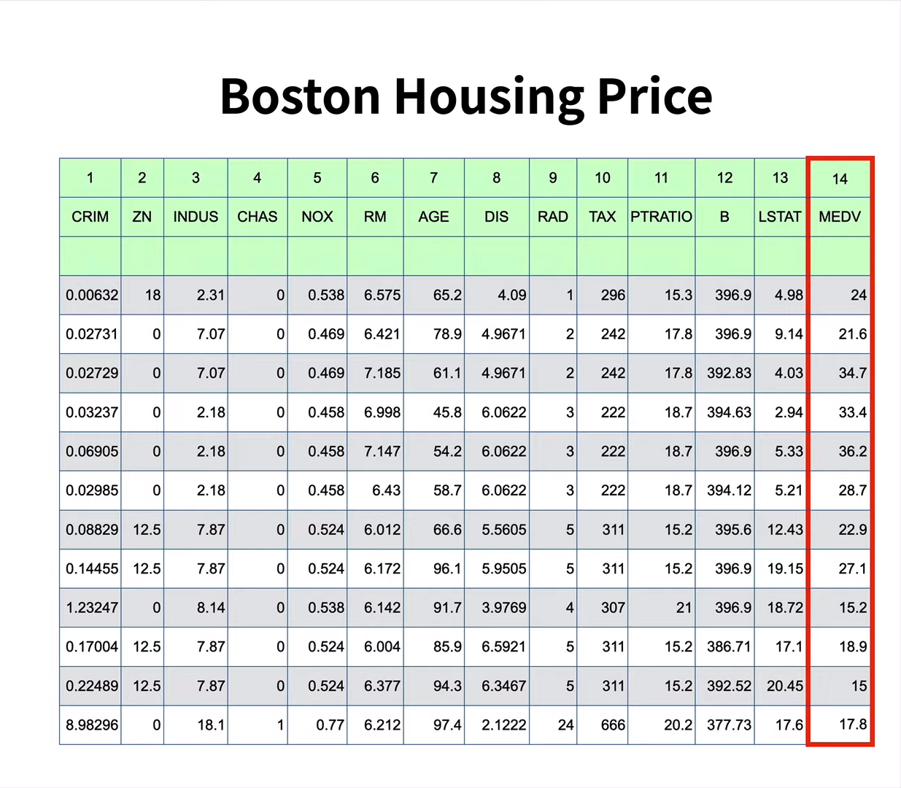
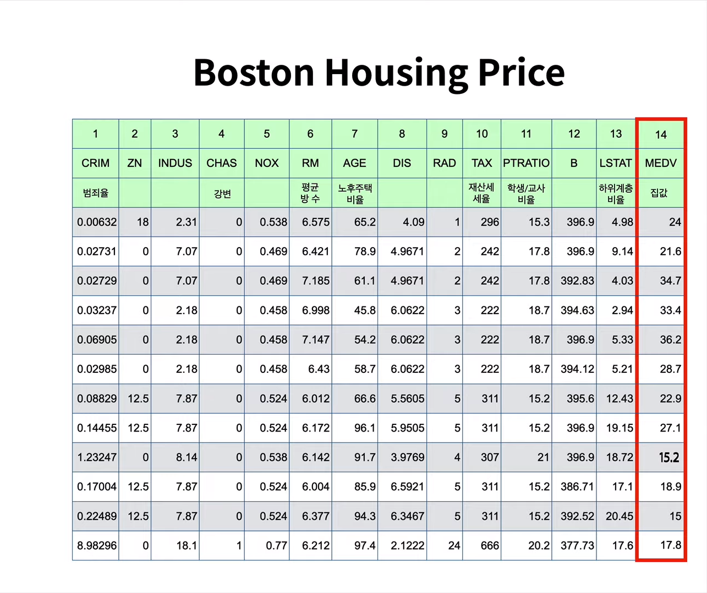

[← 목차로 돌아가기](./README.md)

## 9일차 - Tensorflow(JS) : 여러개의 변수 (2021-01-15)

### 여러개의 변수 - 강의 1

이전까지는 데이터가 일정한 것(`판매량 = 온도*2`)을 학습시켜 왔지만, 이번에는 기계의 도움이 없으면 식을 만들 수 없는 데이터를 가지고 놀아 볼 것임!

- 일정하지 않은 데이터
- 3+개의 열



### 여러개의 변수 - 강의 2

가정 ) 우리는 보스톤의 정책을 관장하는 공무원!

가정 ) 주택 보스톤의 주택가격표를 보고 싶어서 표를 요청함



세로줄 : 각 타운의 특성

가로줄 : 각 타운을 의미

- 1열 CRIM : 범죄율
- 4열 CHAS : 강변에 가까운지 여부
- 6열 RM : 평균 방의 갯수
- 13열 LSTAT : 하위계층의 비율
- 14열 MEDV : 해당 타운들 주택의 중앙가격 (1,000$ 단위)



1~13열은 모두 14열에 영향을 미침!

이러한 복잡한 공식은 인간이 만들기 어렵고, 그래서 사용하는 것이 머신러닝임

### 여러개의 변수 - 강의 3

1. 10.3.html

```html
<!DOCTYPE html>
<html>
 
<head>
    <title>TensorFlow.js Tutorial - boston housing </title>
 
    <!-- Import TensorFlow.js -->
    <script src="https://cdn.jsdelivr.net/npm/@tensorflow/tfjs@1.0.0/dist/tf.min.js"></script>
    <script src="10.3.js"></script>
</head>
 
<body>
    <script>
        /*
        var 보스톤_원인 = [
            [0.00632,18,2.31,0,0.538,6.575,65.2,4.09,1,296,15.3,396.9,4.98],
            [0.02731,0,7.07,0,0.469,6.421,78.9,4.9671,2,242,17.8,396.9,9.14]
        ];
        var 보스톤_결과 = [
            [24], 
            [21.6]
        ];
        */
     
        // 1. 과거의 데이터를 준비합니다. 
        var 원인 = tf.tensor(보스톤_원인);
        var 결과 = tf.tensor(보스톤_결과);
 
        // 2. 모델의 모양을 만듭니다. 
        var X = tf.input({ shape: [13] });
        var Y = tf.layers.dense({ units: 1 }).apply(X);
        var model = tf.model({ inputs: X, outputs: Y });
        var compileParam = { optimizer: tf.train.adam(), loss: tf.losses.meanSquaredError }
        model.compile(compileParam);
 
        // 3. 데이터로 모델을 학습시킵니다. 
//         var fitParam = {epochs: 100}
        var fitParam = { 
          epochs: 100, 
          callbacks:{
            onEpochEnd:
              function(epoch, logs){
                console.log('epoch', epoch, logs, 'RMSE=>', Math.sqrt(logs.loss));
              }
          }
        } // loss 추가 예제
        model.fit(원인, 결과, fitParam).then(function (result) {
             
            // 4. 모델을 이용합니다. 
            // 4.1 기존의 데이터를 이용
            var 예측한결과 = model.predict(원인);
            예측한결과.print();
 
        });  
 
        // 4.2 새로운 데이터를 이용
        // var 다음주온도 = [15,16,17,18,19]
        // var 다음주원인 = tf.tensor(다음주온도);
        // var 다음주결과 = model.predict(다음주원인);
        // 다음주결과.print();
    </script>
</body>
 
</html>
```

2. [10.3.js](./10.3.js)

1000줄 넘어가서 [파일](./10.3.js)로 대체함

-----

동일하게 계속 학습시키면 됨,,

데이터가 커서 한번 도는데에도 오래걸립니다

### 여러개의 변수 - 강의 4

하위계층 비율을 종복변수로 쳐서

종속변수를 2개로 늘려봅시다,,

1. 10.4.html

```html
<!DOCTYPE html>
<html>
 
<head>
    <title>TensorFlow.js Tutorial - boston housing</title>
 
    <!-- Import TensorFlow.js -->
    <script src="https://cdn.jsdelivr.net/npm/@tensorflow/tfjs@1.0.0/dist/tf.min.js"></script>
    <script src="10.4.js"></script>
</head>
 
<body>
    <script>
     
        // 1. 과거의 데이터를 준비합니다. 
        var 원인 = tf.tensor(보스톤_원인);
        var 결과 = tf.tensor(보스톤_결과);
 
        // 2. 모델의 모양을 만듭니다. 
        var X = tf.input({ shape: [12] });
        var Y = tf.layers.dense({ units: 2 }).apply(X);
        var model = tf.model({ inputs: X, outputs: Y });
        var compileParam = { optimizer: tf.train.adam(), loss: tf.losses.meanSquaredError }
        model.compile(compileParam);
 
        // 3. 데이터로 모델을 학습시킵니다. 
//         var fitParam = {epochs: 100}
        var fitParam = { 
          epochs: 100, 
          callbacks:{
            onEpochEnd:
              function(epoch, logs){
                console.log('epoch', epoch, logs, 'RMSE=>', Math.sqrt(logs.loss));
              }
          }
        } // loss 추가 예제
        model.fit(원인, 결과, fitParam).then(function (result) {
             
            // 4. 모델을 이용합니다. 
            // 4.1 기존의 데이터를 이용
            var 예측한결과 = model.predict(원인);
            예측한결과.print();
 
        });  
 
        // 4.2 새로운 데이터를 이용
        // var 다음주온도 = [15,16,17,18,19]
        // var 다음주원인 = tf.tensor(다음주온도);
        // var 다음주결과 = model.predict(다음주원인);
        // 다음주결과.print();
    </script>
</body>
 
</html>
```

2. [10.4.js](./10.4.js)

1000줄 넘어가서 [파일](./10.4.js)로 대체함
